# Compensation & Pension Relational ERD

```mermaid
erDiagram
    veterans ||--o{ veteran_identifiers : has
    veterans ||--o{ service_periods : has
    veterans ||--o{ contacts : has
    veterans ||--o{ addresses : has
    veterans ||--o{ veteran_representatives : represented_by
    representatives ||--o{ veteran_representatives : assigned_to

    veterans ||--o{ claims : files
    claims ||--o{ claim_status_history : tracks
    claims ||--o{ contentions : includes
    claims ||--o{ evidence_items : collects
    contentions ||--o{ contention_evidence : linked_to
    evidence_items ||--o{ contention_evidence : supports

    claims ||--o{ cp_exams : requests
    contentions ||--o{ cp_exams : may_evaluate
    cp_exams ||--o{ exam_findings : records

    claims ||--o{ rating_decisions : results_in
    documents ||--o{ rating_decisions : narrative
    rating_decisions ||--o{ rating_issues : adjudicates
    rating_issues ||--o{ decision_citations : cites
    rating_decisions ||--|| combined_ratings : computes

    veterans ||--o{ compensation_awards : receives

    veterans ||--o{ pension_profiles : has
    pension_profiles ||--o{ pension_income_sources : contains
    pension_profiles ||--o{ pension_assets : contains
    pension_profiles ||--o{ pension_deductions : contains
    pension_profiles ||--o{ pension_awards : determines

    veterans ||--o{ payment_accounts : uses
    veterans ||--o{ payment_transactions : receives
    claims ||--o{ payment_transactions : may_trigger
    payment_accounts ||--o{ payment_transactions : destination
    veterans ||--o{ overpayment_debts : owes

    claims ||--o{ appeals : contested_by
    rating_decisions ||--o{ appeals : challenged_by
    appeals ||--o{ appeal_issues : includes
    rating_issues ||--o{ appeal_issues : references
    appeals ||--o{ hearings : may_have
    documents ||--o{ hearings : transcript

    rating_issues ||--o{ issue_authority_map : linked
    authority_citations ||--o{ issue_authority_map : authority
```

## Domain Modules

- Veteran core: `veterans`, identifiers, service history, contacts, addresses, representation.
- Claims lifecycle: `claims`, `claim_status_history`, `contentions`, `evidence_items`, `contention_evidence`.
- C&P exams: `cp_exams`, `exam_findings`.
- Decisions and ratings: `rating_decisions`, `rating_issues`, `combined_ratings`, `decision_citations`.
- Compensation and pension finance: `compensation_awards`, pension profile/income/assets/deductions/awards.
- Payment and debt: `payment_accounts`, `payment_transactions`, `overpayment_debts`.
- Appeals: `appeals`, `appeal_issues`, `hearings`.
- Governance: `documents`, `audit_events`, `compliance_flags`, `authority_citations`, `issue_authority_map`.
